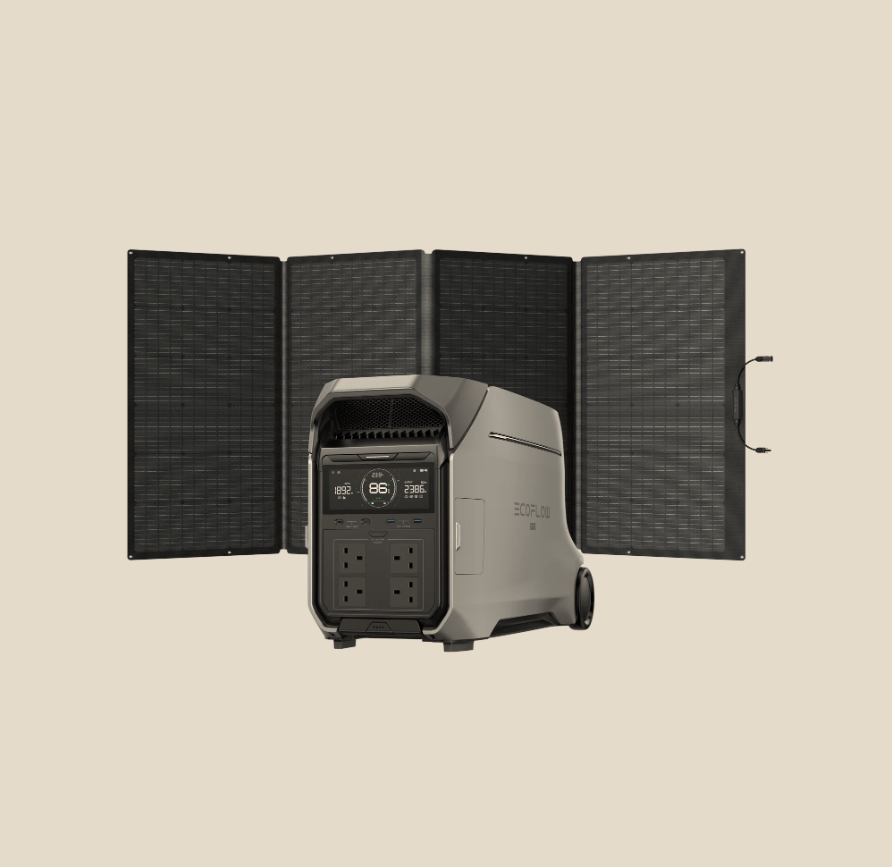
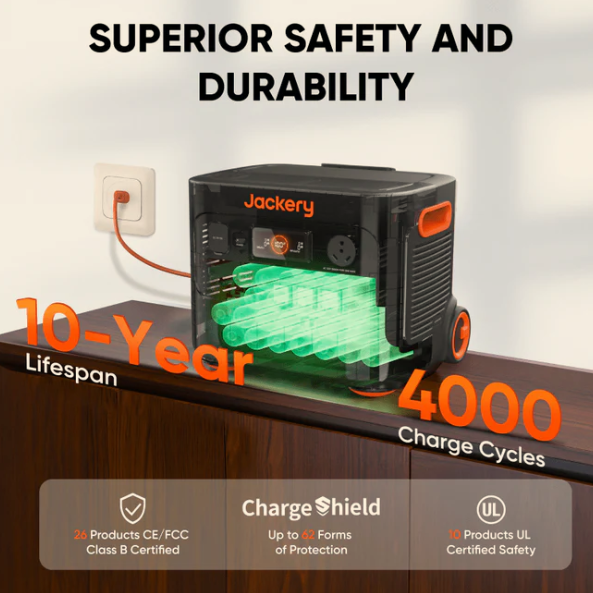

As a homeowner, there is nothing worse than the exact moment the power goes out during a winter storm. Your fridge starts getting warm, the Wi-Fi dies, and you are left sitting in the dark hoping the grid comes back online soon.

For years, the only solution was a traditional gas generator. But after running a 5-year financial audit on emergency backup power, I realized gas generators are essentially a money trap. Gasoline expires, oil needs changing, and you can't run them indoors due to toxic fumes.

That is why I switched to a **Portable Solar Power Station**. They are completely silent, require zero maintenance, and can safely run your fridge and router right from your living room. 

If you are ready to upgrade your emergency prep, here are the top 2 high-tier solar generators on the market right now, and exactly who they are built for.

---

### 1. The "Smart Tech" Choice: EcoFlow DELTA Series

If you want the Tesla of solar generators, this is it. EcoFlow is famous for having the absolute fastest charging speeds in the industry (plug it into the wall, and it goes from 0% to 80% in under an hour). The companion phone app is incredible, letting you monitor exactly how many watts your fridge is pulling from across the room.

**Best for:** The tech-savvy homeowner who wants fast charging and seamless app control.

  <a href="https://amzn.to/4rRrIjm" target="_blank" style="background-color: #0056b3; color: white; padding: 15px 30px; text-decoration: none; border-radius: 5px; font-weight: bold; font-size: 1.2rem; display: inline-block; box-shadow: 0 4px 6px rgba(0,0,0,0.1);">
    Check EcoFlow Price on Amazon
  </a>

---

### 2. The "Ol' Reliable" Choice: Jackery Explorer Series

When you think of portable power, you probably picture Jackery's iconic orange and black design. They are the most famous brand in the space for a reason: absolute bulletproof reliability. While they might not have the flashy app features of the EcoFlow, they are incredibly durable, lightweight, and consistently perform in extreme weather.

**Best for:** Anyone who wants a rugged, famously reliable unit that is incredibly easy to use.

  <a href="https://amzn.to/4uaQ7lc" target="_blank" style="background-color: #0056b3; color: white; padding: 15px 30px; text-decoration: none; border-radius: 5px; font-weight: bold; font-size: 1.2rem; display: inline-block; box-shadow: 0 4px 6px rgba(0,0,0,0.1);">
    Check Jackery Price on Amazon
  </a>

---

### 📊 Head-to-Head: The 2026 Power Comparison

| Feature | EcoFlow Delta Pro 3 | Jackery Explorer 2000 Plus |
| :--- | :--- | :--- |
| **Current Price** | $3,299 | $1,899 |
| **Capacity** | 4,096Wh | 2,042Wh |
| **Output Power** | 4,000W | 3,000W |
| **Cost per Wh** | ~$0.80/Wh | ~$0.93/Wh |
| **The Verdict** | Best Overall Value | Best Entry-Level Pro |

### 🧮 Let’s Talk Real Numbers (The "Blackout Math")

I get asked all the time: "Ethan, why is the EcoFlow $1,400 more?" 

It’s all about the **Cost per Watt-Hour ($/Wh)**. Think of this like the "price per gallon" for your home backup.

* **EcoFlow Delta Pro 3:** $3,299 / 4,096Wh = **$0.80 per Wh**
* **Jackery 2000 Plus:** $1,899 / 2,042Wh = **$0.93 per Wh**

**The Reality Check:** While the Jackery has a lower "sticker price," the EcoFlow is actually **14% cheaper per unit of energy** you’re buying. 

**Why it matters for you:** If you need to run a 150W refrigerator:
* The **Jackery** keeps it cold for about **13.5 hours**.
* The **EcoFlow** keeps it cold for about **27 hours**.

If you have a family and a full fridge of groceries, that extra 14 hours is the difference between a minor inconvenience and $500 in spoiled food. ⚡

### ⚖️ The Final Verdict: Which One Should You Buy?

Both of these units are 100% safe for indoor use—no fumes, no gas, and no noise. Just instant, reliable power.

* **Choose the EcoFlow Delta Pro 3 if:** You have a larger home and need to power heavy appliances like full-sized fridges, well pumps, or AC units for 24+ hours. It is the powerhouse winner for true whole-home resilience.
* **Choose the Jackery Explorer 2000 Plus if:** You want a rugged, bulletproof system that is easy to move between your living room and your truck. It is the reliability winner for those who want professional backup on a more accessible budget.

---

> 💡 **Pro Tip: Check Your Math Before You Buy!**
> Not sure exactly how much wattage your specific appliances need? Don't guess when it comes to emergency prep. 
> 
> 👇 **Download our FREE Blackout-Proof Home Checklist below to calculate your exact power needs.** 👇

  

